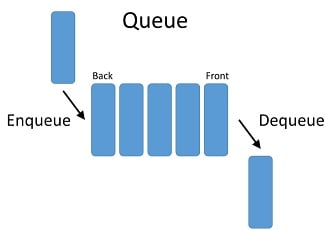

# Queues
If you ever tried to contact a customer service line, you usually expect to wait for a while, but what determines your wait time? That would be your place in the queue. Computers and software utilize queues to process collections of requests in an orderly manner. In this lesson we will learn how to implement them in Python.

## FIFO
A queue can be implemented using python lists by utilizing the `insert()` and `pop()` methods. As opposed to stacks that utilize **(LIFO)** "Last In, First Out", in a queue the data element that is inserted *first* will be removed *first*. We call this **(FIFO)** "First In, First Out"

## Enqueue & Dequeue
Operations that can be performed on the queue are:

1. **Enque**: It adds an item to the queue. If the queue is full, then it is said to be an Overflow condition.

2. **Dequeue**: It removes an item from the queue. The items are popped in the same order in which they are pushed. If the queue is empty, then it is said to be an Underflow condition.

3. **Front**: It gives the front item from the queue.

4. **Rear**: It gives the last item from the queue.

## Example : Implementing Queue Using List :


```python
q=[]
q.append('dog')
q.append('cat')
q.append('dinosaur')
q.append('squirrel')
print("Initial Queue is:",q)
print()
print(q.pop(0))
print()
print("After Removing elements:",q)
```
**Output**

```python
Initial Queue is: ['dog', 'cat', 'dinosaur', 'squirrel']

dog

After Removing elements: ['cat', 'dinosaur', 'squirrel']
```
This example demonstrates (FIFO) utilizing a list of animals. We see that *dog* was the first item in the list, after utilizing **pop(0)** notice that *dog* was removed, leaving the remaining list in it's sequential order.

## Problem to Solve : Write a program to queue orders taken
You have a bunch of chores to do, but are procrastinating because you don't know where to start. Fortunately you have some programming knowledge. Create a program in Python where you can write down your todos as they come to you and they will queue in the order you wrote them so you don't have to think of "what's next".


**Your output should look something like:**
```
Please enter your chores: 
wash
['wash']
sweep
['wash', 'sweep']
mop 
['wash', 'sweep', 'mop']
q
```
**Output**
```
wash
Chores left: sweep
Chores left: mop
```

You can check your code with the solution here: [Solution]
(todo.py)

[Back to Welcome Page](0-Hello-World.md)


