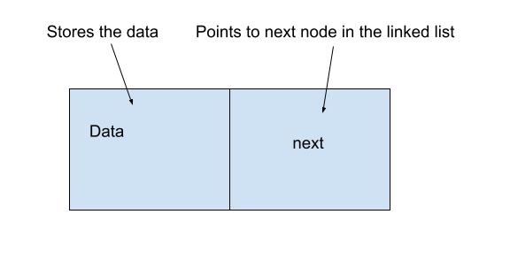
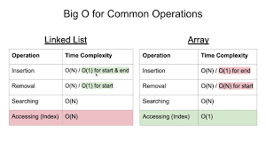

## Nodes
A node is an object which has a data field and a pointer to another node in the linked list. 



**This is how it would be implemented**
```python
class Node:
    def __init__(self,data):
        self.data=data
        self.next=None
```

# Linked Lists
Now that we understand nodes and how data is stored in memory, we can talk about Linked Lists. A Linked List is a data structure that contains data objects that are connected by links. A linked list consists of nodes that contain a field and a reference to the next node in the linked list. 

**Here is an example of a Linked List**
 

## Insert
There are three ways of inserting data into a Linked List.

1. **Insert at the head** - being the most straightforward to insert. You simply create a new node and pointing to it as head of the list.

To do this:
* Create a new node (we will call it new_node)

* Set the "next" of the new node to the current head (new_node.next = self.head)

* Set the "prev" of the current head to the new node (self.head.prev = new_node)

* Set the head equal to the new node (self.head = new_node)

2. **Insert at the tail** -
To insert at the tail, you follow the exact same steps as the head, except you replace "head" to "tail".

3. **Insert at the middle** - To insert at the middle, there is an extra step involved. As opposed to adding something to the beginning or end, you are inserting data between existing data which means that you will need to rearrange how data is being pointed to. The steps are similar to the previous ones, but you are also including "current".
It should look something like this: 
* Create a new node (we will call it new_node)

* Set the "prev" of the new node to the current node (new_node.prev = current)

* "
Set the "next" of the new node to the next node after current (new_node.next = current.next)

* Set the "prev" of the "next" node after current to the new node (current.next.prev = new_node)

* Set the next of the current node to the new node (current.next = new_node)


## Remove
To remove a node from a linked list
* First, you need to traverse the list until you find the node you want to remove. 
* Once you chose what note to remove, you will basically "re-link" and that will remove it. You simply want to link its previous and next nodes. Keep in mind that it will be important to keep track of the previous node as you traverse the list.

## Big O Examples
 
## Example :
```python
llist = LinkedList()
llist.remove_node("a")
Exception: List is empty

llist = LinkedList(["a", "b", "c", "d", "e"])
llist
a -> b -> c -> d -> e -> None

llist.remove_node("a")
llist
b -> c -> d -> e -> None

llist.remove_node("e")
llist
b -> c -> d -> None

llist.remove_node("c")
llist
b -> d -> None

llist.remove_node("a")
Exception: Node with data 'a' not found
```
## Problem to Solve :
You are doing your weekly grocery run at Walmart, but when you take out your shopping list you realize that it is last week's. You go back home and think of a great idea to create a program that will allow you to modify your list to prioritize, add, or remove  items. 

There are 4 items that are the most important:

1. Milk
2. Eggs
3. Bread
4. Water

(You then remember you needed this fifth item at the last moment)
5. Xbox 

You successfully created your program and tested it with your previous list. Utilize the following starting code to make modifications to shopping list and *remove* unecessary items,*prioritize/rearrange* the previously mentioned items. Finally add the final item to the end/tail. 

```python
class Node:
    def __init__(self, data=None, next=None):
        self.data = data
        self.next = next

class LinkedList:
    def __init__(self):
        self.head = None

    def print(self):
        if self.head is None:
            print("Shopping list is empty")
            return
        item = self.head
        list = ''
        while item:
            list += str(item.data)+' --> ' if item.next else str(item.data)
            item = item.next
        print(list)

    def get_length(self):
        count = 0
        item = self.head
        while item:
            count+=1
            item = item.next

        return count

    def insert_head(self, data):
        node = Node(data, self.head)
        self.head = node

    def insert_tail(self, data):
        if self.head is None:
            self.head = Node(data, None)
            return

        item = self.head

        while item.next:
            item = item.next

        item.next = Node(data, None)

    def insert_new(self, index, data):
        if index<0 or index>self.get_length():
            raise Exception("Error")

        if index==0:
            self.insert_head(data)
            return

        count = 0
        item = self.head
        while item:
            if count == index - 1:
                node = Node(data, item.next)
                item.next = node
                break

            item = item.next
            count += 1

    def remove(self, index):
        if index<0 or index>=self.get_length():
            raise Exception("Error")

        if index==0:
            self.head = self.head.next
            return

        count = 0
        item = self.head
        while item:
            if count == index - 1:
                item.next = item.next.next
                break

            item = item.next
            count+=1

    def insert_items(self, data_list):
        self.head = None
        for data in data_list:
            self.insert_tail(data)


if __name__ == '__main__':
    ll = LinkedList()
    ll.insert_items(["Bananas","Eggs","Legos","Shampoo"])
```


You can check your code with the solution here: [Solution](shopping-solution.py)

[Back to Welcome Page](0-Hello-World.md)